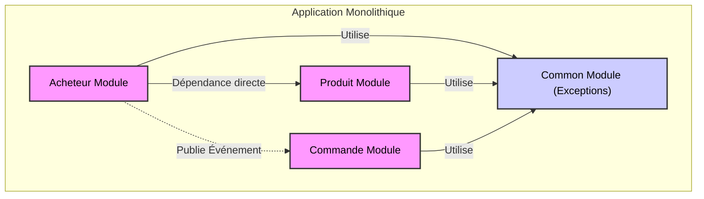
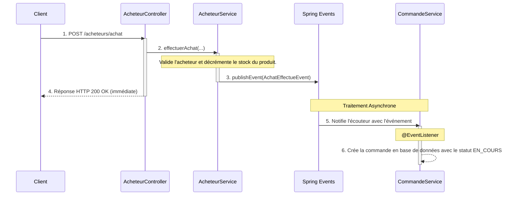

# Démonstration d'Architecture avec Spring Modulith

Ce projet est une application de démonstration construite pour illustrer le pattern **Monolithe Modulaire** avec **Spring Modulith**. Son objectif principal est de servir de cas d'étude pour comprendre comment structurer une application monolithique de manière propre, maintenable et évolutive, tout en préparant une transition éventuelle vers une architecture de microservices.

L'application utilise une base de données **PostgreSQL**.

---

## 📖 Vision Académique de l'Architecture

Le "Modular Monolith" n'est pas un monolithe traditionnel. C'est une approche architecturale qui applique les principes du **Domain-Driven Design (DDD)** à l'intérieur d'une seule base de code et d'un seul déploiement. L'objectif est de combiner la simplicité opérationnelle du monolithe avec la clarté structurelle des microservices.

### Organisation des Modules Métier

Le projet est divisé en modules métier qui représentent des "Bounded Contexts" (Contextes Bounded) du DDD. Spring Modulith aide à renforcer les frontières entre ces modules.



---

## 🗂️ Structure du Projet et Rôle des Fichiers

Chaque package principal (`acheteur`, `commande`, `produit`) est un **module Spring Modulith**.

### Anatomie d'un Module

- **`api/`**: Façade publique du module (`RestController`).
- **`domain/`**: Entités JPA et Enums (le cœur du modèle métier).
- **`dto/`**: Objets de Transfert de Données (`...RequestDTO`, `...ResponseDTO`).
- **`events/`**: Événements publiés par le module.
- **`service/`**: Logique métier, organisée avec une **interface** (`...ServiceInterface`) et son **implémentation** (`...ServiceImpl`).
- **`repository/`**: Interfaces Spring Data JPA.
- **`mapper/`**: Interfaces MapStruct pour la conversion entre entités et DTOs.
- **`package-info.java`**: Déclaration formelle du module via `@ApplicationModule`.

---

## 🔑 Concepts Clés de Spring Modulith

### Communication par Événements

La communication entre modules ne se fait pas par des appels de service directs, mais par la publication d'événements pour maintenir un couplage faible.



### Gestion Centralisée des Erreurs

Le module `common` contient un `GlobalExceptionHandler` annoté avec `@RestControllerAdvice`. Il intercepte les exceptions levées par les contrôleurs et les transforme en réponses HTTP claires et standardisées.

-   `NoSuchElementException` → **HTTP 404 Not Found**
-   `IllegalArgumentException` / `IllegalStateException` → **HTTP 400 Bad Request**
-   Toute autre `Exception` → **HTTP 500 Internal Server Error**

---

## 🚀 Plan de Transition Complet vers les Microservices

L'architecture de ce projet a été conçue comme une rampe de lancement. Voici un plan stratégique détaillé pour faire évoluer ce monolithe modulaire vers une architecture de microservices complète, en utilisant le **Strangler Fig Pattern**.

L'ordre d'extraction est crucial et dicté par les dépendances. L'ordre logique est : **1. Produit**, **2. Acheteur**, **3. Commande**.

### Phase 1 : Extraction du Microservice `produit-service`

*   **Pourquoi en premier ?** Le module `Produit` est le plus indépendant. Il n'a aucune dépendance sortante vers d'autres modules métier.

*   **Étapes :**
    1.  **Infrastructure** : Créer un nouveau projet Spring Boot (`produit-service`), une base de données PostgreSQL dédiée, et un broker de messages (ex: RabbitMQ).
    2.  **Migration du Code & Données** : Copier le code du module `produit` dans le nouveau service. Migrer les données de la table `produit` vers la nouvelle base de données.
    3.  **Remplacer les Dépendances Internes** : Le `AcheteurServiceImpl` (encore dans le monolithe) appelle `ProduitService`. Cet appel direct doit être remplacé par un appel réseau. La meilleure approche est **asynchrone** :
        *   `AcheteurService` publie un événement `StockADeduireEvent` sur le broker.
        *   Le `produit-service` s'abonne à cet événement et décrémente son stock. Cela garantit le découplage et la résilience.
    4.  **API Gateway** : Mettre en place une API Gateway (ex: Spring Cloud Gateway) pour rediriger toutes les requêtes ` /produits/** ` vers le nouveau `produit-service`.
    5.  **Nettoyage** : Une fois le service stable, supprimer le module `produit` du monolithe.

### Phase 2 : Extraction du Microservice `acheteur-service`

*   **Pourquoi en second ?** Le module `Acheteur` dépend du `Produit` (qui est maintenant un service externe).

*   **Étapes :**
    1.  **Infrastructure** : Créer un nouveau projet `acheteur-service` avec sa propre base de données.
    2.  **Migration du Code & Données** : Déplacer le code et migrer les données de la table `acheteur`.
    3.  **Externaliser la Publication d'Événements** :
        *   Le `AcheteurServiceImpl` publie un `AchatEffectueEvent`. Cet événement, qui était en mémoire, doit maintenant être publié sur le broker de messages externe. Le module `Commande` (encore dans le monolithe) devra adapter son écouteur pour le consommer depuis le broker. Spring Modulith facilite cette transition avec des modules comme `spring-modulith-starter-amqp`.
    4.  **API Gateway** : Mettre à jour la Gateway pour rediriger les requêtes ` /acheteurs/** ` vers l'`acheteur-service`.
    5.  **Nettoyage** : Supprimer le module `acheteur` du monolithe. À ce stade, le monolithe ne contient plus que la logique de `Commande` et `Common`.

### Phase 3 : Extraction du Microservice `commande-service`

*   **Pourquoi en dernier ?** Le module `Commande` est le plus dépendant. Il réagit à des événements et agrège des données provenant des autres domaines.

*   **Étapes :**
    1.  **Infrastructure & Migration** : Mêmes étapes que pour les autres services (projet, DB, migration).
    2.  **Gérer l'Agrégation de Données (le plus grand défi)** :
        *   **Problème** : L'endpoint `GET /commandes` renvoie des détails sur l'acheteur et le produit. Dans un monolithe, c'est une simple jointure SQL. Dans les microservices, les données sont dans des bases de données séparées.
        *   **Solution - Composition d'API** : Le `commande-service`, en recevant une requête pour les détails d'une commande, appelle :
            1.  L'`acheteur-service` via `GET /acheteurs/{id}` pour obtenir les détails de l'acheteur.
            2.  Le `produit-service` via `GET /produits/{id}` pour obtenir les détails du produit.
            3.  Il **compose** ensuite la réponse finale.
        *   **Inconvénients** : Latence accrue (appels réseau en série) et couplage en cascade. Une alternative plus avancée serait de maintenir une réplique locale des données nécessaires (CQRS).
    3.  **API Gateway** : Rediriger ` /commandes/** ` vers le nouveau `commande-service`.
    4.  **Nettoyage Final** : Le monolithe originel est maintenant vide. Il peut être archivé. L'architecture est entièrement distribuée.

---

## 🛠️ Comment Lancer le Projet

1.  Clonez le repository.
2.  Assurez-vous d'avoir JDK 17+ et Maven installés.
3.  Configurez votre base de données **PostgreSQL** dans `src/main/resources/application.properties`. Un exemple est fourni :
    ```properties
    spring.datasource.url=jdbc:postgresql://localhost:5432/votre_db
    spring.datasource.username=votre_user
    spring.datasource.password=votre_pass
    spring.jpa.hibernate.ddl-auto=update
    ```
4.  Exécutez la commande à la racine du projet :
    ```bash
    # Pour Windows
    ./mvnw.cmd spring-boot:run
    
    # Pour Linux / macOS
    ./mvnw spring-boot:run
    ```
5.  Une fois l'application démarrée, accédez à la documentation Swagger UI :
    [http://localhost:8080/swagger-ui.html](http://localhost:8080/swagger-ui.html)

---

## 🕹️ Documentation de l'API

Les exemples de corps de requête ci-dessous sont illustratifs.

### Module `Acheteur`

-   `GET /acheteurs` : Lister tous les acheteurs.
-   `GET /acheteurs/{id}` : Récupérer un acheteur par son ID.
-   `POST /acheteurs` : Créer un nouvel acheteur.
    ```json
    {
      "nom": "Fatima Alami",
      "email": "fatima.alami@email.ma",
      "adresse": "123 Avenue Hassan II, Casablanca",
      "telephone": "0600112233"
    }
    ```
-   `PUT /acheteurs/{id}` : Mettre à jour un acheteur.
-   `DELETE /acheteurs/{id}` : Supprimer un acheteur.
-   `POST /acheteurs/achat` : Effectuer un achat.
    ```json
    {
      "acheteurId": 1,
      "produitId": 1,
      "quantite": 2
    }
    ```

### Module `Produit`

-   `GET /produits` : Lister tous les produits.
-   `GET /produits/{id}` : Récupérer un produit par son ID.
-   `POST /produits` : Créer un nouveau produit.
    ```json
    {
      "nom": "Tapis Berbère",
      "description": "Tapis fait main, pure laine, 2x3m.",
      "prix": 1500.00,
      "quantiteEnStock": 10
    }
    ```
-   `PUT /produits/{id}` : Mettre à jour un produit.
-   `DELETE /produits/{id}` : Supprimer un produit.

### Module `Commande`

-   `GET /commandes` : Lister toutes les commandes avec les détails de l'acheteur et du produit.
    -   **Exemple de réponse** :
    ```json
    [
      {
        "id": 1,
        "dateCommande": "2024-05-22T10:30:00",
        "statut": "CONFIRMEE",
        "quantite": 2,
        "acheteur": {
          "id": 1,
          "nom": "Fatima Alami",
          "email": "fatima.alami@email.ma",
          "adresse": "123 Avenue Hassan II, Casablanca",
          "telephone": "0600112233"
        },
        "produit": {
          "id": 1,
          "nom": "Tapis Berbère",
          "description": "Tapis fait main, pure laine, 2x3m.",
          "prix": 1500.00,
          "quantiteEnStock": 8
        }
      }
    ]
    ```

-   `GET /commandes/{id}` : Récupérer une commande par son ID.
-   `DELETE /commandes/{id}` : Supprimer une commande.
-   `PUT /commandes/{commandeId}/statut` : Changer le statut d'une commande.
    ```json
    {
      "nouveauStatut": "CONFIRMEE"
    }
    ```
    (Statuts possibles : `EN_COURS`, `CONFIRMEE`, `ANNULEE`) 