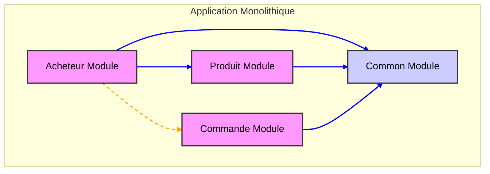
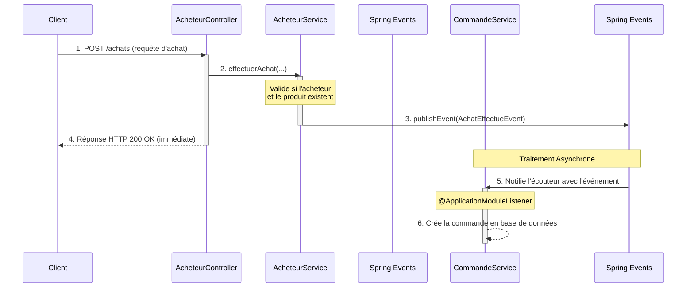

# Démonstration d'Architecture avec Spring Modulith

Ce projet est une application de démonstration construite pour illustrer le pattern **Monolithe Modulaire** avec **Spring Modulith**. Son objectif principal est de servir de cas d'étude pour comprendre comment structurer une application monolithique de manière propre, maintenable et évolutive, tout en préparant une transition éventuelle vers une architecture de microservices.

---

## 📖 Vision Académique de l'Architecture

Le "Modular Monolith" n'est pas un monolithe traditionnel. C'est une approche architecturale qui applique les principes du **Domain-Driven Design (DDD)** à l'intérieur d'une seule base de code et d'un seul déploiement. L'objectif est de combiner la simplicité opérationnelle du monolithe avec la clarté structurelle des microservices.

### Comparaison Architecturale

| Critère | Monolithe Traditionnel | Monolithe Modulaire (ce projet) |
| :--- | :--- | :--- |
| **Structure** | Couplage fort, souvent chaotique ("Big Ball of Mud") | Modules découplés avec des frontières explicites |
| **Évolutivité** | Difficile, tout évolue en même temps | Facile, les modules peuvent être modifiés indépendamment |
| **Intégration** | Courbe d'apprentissage élevée pour les nouveaux arrivants | Compréhension facilitée grâce aux domaines métier clairs |
| **Déploiement** | Un seul artefact | Un seul artefact, mais structurellement sain |
| **Testabilité** | Tests d'intégration complexes et lents | Tests isolés par module, rapides et fiables |

### Organisation des Modules Métier

Le projet est divisé en modules métier qui représentent des "Bounded Contexts" (Contextes Bounded) du DDD. Spring Modulith aide à renforcer les frontières entre ces modules. Le schéma suivant illustre les dépendances :

-   **Flèche Bleue (Dépendance Directe)** : Le module source utilise directement des classes du module cible (ex: un `Service` qui appelle un `Repository` d'un autre module).
-   **Flèche Orange (Dépendance par Événement)** : Le module source publie un événement, et le module cible y réagit de manière asynchrone et découplée.



---

## 🗂️ Structure du Projet et Rôle des Fichiers

Chaque package principal (`acheteur`, `commande`, `produit`) est un **module Spring Modulith**.

```
src/main/java/com/example/springmodulithexample/
├── acheteur/           # Module de gestion des acheteurs
├── commande/           # Module de gestion des commandes
├── produit/            # Module de gestion des produits
└── SpringModulithExampleApplication.java
```

### Le Rôle Central du `package-info.java`

Ce fichier, souvent négligé, est **fondamental** dans une architecture Spring Modulith.

- **Déclaration du Module** : L'annotation `@ApplicationModule` transforme un simple package Java en un module logique avec des frontières définies.
- **Point d'Entrée Documentaire** : Il sert de documentation officielle pour le module, expliquant son rôle et ses responsabilités.
- **Contrôle Architectural** : Spring Modulith l'utilise pour vérifier les dépendances et s'assurer qu'aucune communication illicite n'a lieu entre les modules.

### Anatomie d'un Module

- **`api/`**: Contient les `Controller`s. C'est la façade publique du module, exposant les fonctionnalités via des points de terminaison REST.
- **`domain/`**: Contient les entités JPA. C'est le cœur du modèle métier du module.
- **`dto/`**: Data Transfer Objects. Structures de données optimisées pour la communication avec l'extérieur (API).
- **`events/`**: Contient les événements publiés par le module. C'est le principal mécanisme de communication inter-module.
- **`service/`**: Implémente la logique métier. Orchestre les opérations sur le domaine et publie les événements.
- **`repository/`**: Interfaces Spring Data JPA pour l'accès aux données.

---

## 🔑 Concepts Clés de Spring Modulith

### Annotations Fondamentales

- `@ApplicationModule` (sur `package-info.java`) : Déclare officiellement un package comme étant un module.
- `@ApplicationModuleListener` : Transforme une méthode en un écouteur d'événements asynchrone et transactionnel. Le traitement est garanti de s'exécuter après que la transaction de publication a réussi (commit). Cela assure une cohérence forte à l'intérieur du monolithe.
- `@ApplicationModuleTest` : Permet de lancer un test d'intégration qui ne charge que le contexte Spring du module spécifié. Cela valide non seulement la logique du module mais aussi ses dépendances déclarées, garantissant une isolation quasi-parfaite.

### Communication par Événements : Le Découplage Fort

La communication entre modules ne se fait pas par des appels de service directs, mais par la publication d'événements.

1.  Un service (ex: `AcheteurService`) publie un événement métier (ex: `AchatEffectueEvent`).
2.  Le service émetteur n'a **aucune connaissance** des modules qui écouteront cet événement.
3.  Un ou plusieurs autres modules (ex: `CommandeService`) s'abonnent à cet événement via `@ApplicationModuleListener`.
4.  Le traitement est asynchrone, ce qui améliore la réactivité et la résilience de l'application.



#### Événements Spring Modulith vs. Broker Externe

| Caractéristique | Événements Spring Modulith (Dans le Monolithe) | Broker Externe (Kafka/RabbitMQ) |
| :--- | :--- | :--- |
| **Portée** | Application monolithique | Systèmes distribués (Microservices) |
| **Latence** | Quasi-instantanée (en mémoire) | Dépend du réseau et du broker |
| **Fiabilité** | Liée à la transaction de la base de données locale | Persistance et rejeu garantis par le broker |
| **Complexité** | **Faible** : Aucune infrastructure externe requise | **Élevée** : Nécessite un déploiement et une maintenance |
| **Cas d'usage** | Communication inter-modules, logique de saga simple | Communication inter-services, Event Sourcing |

---

## 🚀 Stratégie de Transition vers les Microservices

Le principal avantage de cette architecture est qu'elle constitue une étape intermédiaire naturelle vers les microservices. Les modules sont déjà des candidats à l'extraction.

#### Astuces pour la migration :

1.  **Identifier le Candidat** : Choisissez un module à extraire. Les modules avec peu de dépendances entrantes (comme `Produit` ou `Acheteur`) sont de bons candidats.
2.  **Externaliser la Communication** : La communication par événement, actuellement en mémoire, doit être remplacée par un broker de messages externe (ex: RabbitMQ, Kafka). Spring Modulith propose des dépendances comme `spring-modulith-starter-amqp` pour faciliter cette transition.
3.  **Créer le Nouveau Service** : Créez un nouveau projet Spring Boot pour le module extrait. Copiez le code du module (`domain`, `service`, `repository`, etc.).
4.  **Isoler la Persistance** : Le nouveau microservice doit avoir sa propre base de données ou son propre schéma. Les données doivent être migrées.
5.  **Mettre à jour les Appels** : Le code restant dans le monolithe qui publiait des événements doit maintenant envoyer des messages au broker. Les appels API directs vers le module extrait doivent être redirigés vers le nouveau service, souvent via une API Gateway.
6.  **Répéter le Processus** : Extrayez les modules un par un, en réduisant progressivement la taille du monolithe originel, qui peut finir par disparaître ou devenir un simple service parmi d'autres.

Cette approche, connue sous le nom de **Strangler Fig Pattern**, permet une migration progressive et contrôlée, minimisant les risques par rapport à une refonte "big bang".

---

## 🛠️ Comment Lancer le Projet

1.  Clonez le repository.
2.  Assurez-vous d'avoir JDK 17+ et Maven installés.
3.  Exécutez la commande à la racine du projet :
    ```bash
    mvn spring-boot:run
    ```
4.  Une fois l'application démarrée, vous pouvez accéder à la documentation de l'API Swagger UI :
    [http://localhost:8080/swagger-ui.html](http://localhost:8080/swagger-ui.html)

---

## 🕹️ Endpoints de l'API

Voici un résumé des principaux points de terminaison disponibles pour interagir avec l'application.

### Module Acheteur

-   **Créer un acheteur**
    -   `POST /acheteurs`
    -   **Body** :
        ```json
        {
          "nom": "Ahmed Berrada",
          "email": "ahmed.berrada@email.ma",
          "adresse": "22 Rue de Fès, Rabat"
        }
        ```

-   **Lister tous les acheteurs**
    -   `GET /acheteurs`

-   **Effectuer un achat**
    -   `POST /acheteurs/achat`
    -   **Body** :
        ```json
        {
          "acheteurId": 1,
          "produitId": 2,
          "quantite": 1
        }
        ```

### Module Produit

-   **Créer un produit**
    -   `POST /produits`
    -   **Body** :
        ```json
        {
          "nom": "Théière en Inox",
          "prix": 220.00,
          "description": "Théière marocaine traditionnelle, capacité 1L.",
          "quantiteEnStock": 150
        }
        ```

-   **Lister tous les produits**
    -   `GET /produits`

### Module Commande

-   **Lister toutes les commandes**
    -   `GET /commandes`

-   **Changer le statut d'une commande**
    -   `PUT /commandes/{commandeId}/statut`
    -   Remplace `{commandeId}` par l'ID de la commande à modifier.
    -   **Body** :
        ```json
        {
          "nouveauStatut": "CONFIRMEE"
        }
        ```
    -   Les statuts possibles sont : `EN_COURS`, `CONFIRMEE`, `ANNULEE`. 