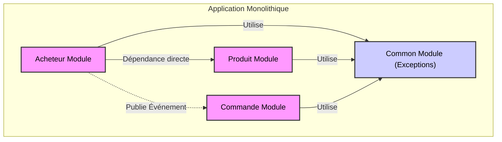
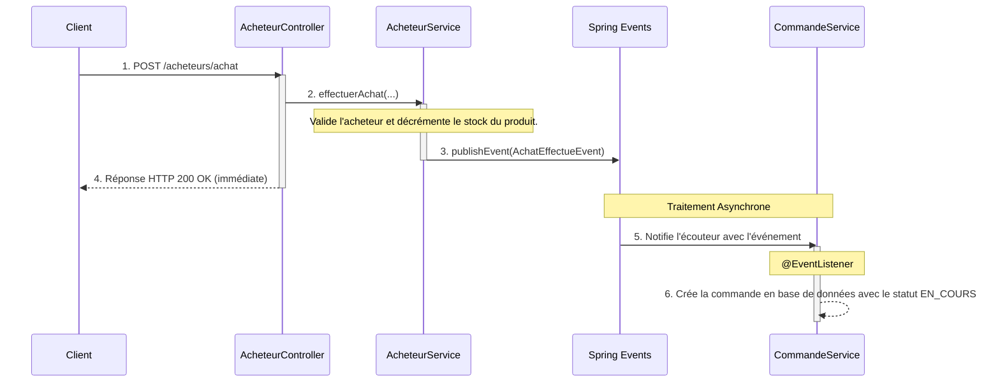

# Démonstration d'Architecture avec Spring Modulith

Ce projet est une application de démonstration construite pour illustrer le pattern **Monolithe Modulaire** avec **Spring Modulith**. Son objectif principal est de servir de cas d'étude pour comprendre comment structurer une application monolithique de manière propre, maintenable et évolutive, tout en préparant une transition éventuelle vers une architecture de microservices.

L'application utilise une base de données **PostgreSQL**.

---

## 📖 Vision Académique de l'Architecture

Le "Modular Monolith" n'est pas un monolithe traditionnel. C'est une approche architecturale qui applique les principes du **Domain-Driven Design (DDD)** à l'intérieur d'une seule base de code et d'un seul déploiement. L'objectif est de combiner la simplicité opérationnelle du monolithe avec la clarté structurelle des microservices.

### Organisation des Modules Métier

Le projet est divisé en modules métier qui représentent des "Bounded Contexts" (Contextes Bounded) du DDD. Spring Modulith aide à renforcer les frontières entre ces modules.


```mermaid
graph TD;
    subgraph "Application Monolithique"
        Acheteur["Acheteur Module"];
        Produit["Produit Module"];
        Commande["Commande Module"];
        Common["Common Module (Exceptions)"];

        Acheteur -- Dépendance directe --> Produit;
        Acheteur -. Publie Événement .-> Commande;

        Acheteur -- Utilise --> Common;
        Produit -- Utilise --> Common;
        Commande -- Utilise --> Common;
    end

    classDef module fill:#f9f,stroke:#333,stroke-width:2px,color:#000;
    classDef common fill:#ccf,stroke:#333,stroke-width:2px,color:#000;
    class Acheteur,Produit,Commande module;
    class Common common;
```

---

## 🗂️ Structure du Projet et Rôle des Fichiers

Chaque package principal (`acheteur`, `commande`, `produit`) est un **module Spring Modulith**.

### Anatomie d'un Module

- **`api/`**: Façade publique du module (`RestController`).
- **`domain/`**: Entités JPA et Enums (le cœur du modèle métier).
- **`dto/`**: Objets de Transfert de Données (`...RequestDTO`, `...ResponseDTO`).
- **`events/`**: Événements publiés par le module.
- **`service/`**: Logique métier, organisée avec une **interface** (`...ServiceInterface`) et son **implémentation** (`...ServiceImpl`).
- **`repository/`**: Interfaces Spring Data JPA.
- **`mapper/`**: Interfaces MapStruct pour la conversion entre entités et DTOs.
- **`package-info.java`**: Déclaration formelle du module via `@ApplicationModule`.

---

## 🔑 Concepts Clés de Spring Modulith

### Communication par Événements

La communication entre modules ne se fait pas par des appels de service directs, mais par la publication d'événements pour maintenir un couplage faible.


```mermaid
sequenceDiagram
    participant Client
    participant AcheteurController
    participant AcheteurService
    participant Spring Events
    participant CommandeService

    Client->>AcheteurController: 1. POST /acheteurs/achat
    activate AcheteurController
    AcheteurController->>AcheteurService: 2. effectuerAchat(...)
    activate AcheteurService
    Note over AcheteurService: Valide l'acheteur et décrémente le stock du produit.
    AcheteurService->>Spring Events: 3. publishEvent(AchatEffectueEvent)
    deactivate AcheteurService
    AcheteurController-->>Client: 4. Réponse HTTP 200 OK (immédiate)
    deactivate AcheteurController

    Note over Spring Events, CommandeService: Traitement Asynchrone
    Spring Events->>CommandeService: 5. Notifie l'écouteur avec l'événement
    activate CommandeService
    Note over CommandeService: @EventListener
    CommandeService-->>CommandeService: 6. Crée la commande en base de données avec le statut EN_COURS
    deactivate CommandeService
```

### Gestion Centralisée des Erreurs

Le module `common` contient un `GlobalExceptionHandler` annoté avec `@RestControllerAdvice`. Il intercepte les exceptions levées par les contrôleurs et les transforme en réponses HTTP claires et standardisées.

-   `NoSuchElementException` → **HTTP 404 Not Found**
-   `IllegalArgumentException` / `IllegalStateException` → **HTTP 400 Bad Request**
-   Toute autre `Exception` → **HTTP 500 Internal Server Error**

---

## 🚀 Stratégie de Transition vers les Microservices

L'approche du monolithe modulaire facilite grandement une migration future vers les microservices en suivant le **Strangler Fig Pattern**. Les modules étant déjà bien délimités et faiblement couplés, ils sont des candidats naturels à l'extraction.

---

## 🛠️ Comment Lancer le Projet

1.  Clonez le repository.
2.  Assurez-vous d'avoir JDK 17+ et Maven installés.
3.  Configurez votre base de données **PostgreSQL** dans `src/main/resources/application.properties`. Un exemple est fourni :
    ```properties
    spring.datasource.url=jdbc:postgresql://localhost:5432/votre_db
    spring.datasource.username=votre_user
    spring.datasource.password=votre_pass
    spring.jpa.hibernate.ddl-auto=update
    ```
4.  Exécutez la commande à la racine du projet :
    ```bash
    # Pour Windows
    ./mvnw.cmd spring-boot:run
    
    # Pour Linux / macOS
    ./mvnw spring-boot:run
    ```
5.  Une fois l'application démarrée, accédez à la documentation Swagger UI :
    [http://localhost:8080/swagger-ui.html](http://localhost:8080/swagger-ui.html)

---

## 🕹️ Documentation de l'API

Les exemples de corps de requête ci-dessous sont illustratifs.

### Module `Acheteur`

-   `GET /acheteurs` : Lister tous les acheteurs.
-   `GET /acheteurs/{id}` : Récupérer un acheteur par son ID.
-   `POST /acheteurs` : Créer un nouvel acheteur.
    ```json
    {
      "nom": "Fatima Alami",
      "email": "fatima.alami@email.ma",
      "adresse": "123 Avenue Hassan II, Casablanca",
      "telephone": "0600112233"
    }
    ```
-   `PUT /acheteurs/{id}` : Mettre à jour un acheteur.
-   `DELETE /acheteurs/{id}` : Supprimer un acheteur.
-   `POST /acheteurs/achat` : Effectuer un achat.
    ```json
    {
      "acheteurId": 1,
      "produitId": 1,
      "quantite": 2
    }
    ```

### Module `Produit`

-   `GET /produits` : Lister tous les produits.
-   `GET /produits/{id}` : Récupérer un produit par son ID.
-   `POST /produits` : Créer un nouveau produit.
    ```json
    {
      "nom": "Tapis Berbère",
      "description": "Tapis fait main, pure laine, 2x3m.",
      "prix": 1500.00,
      "quantiteEnStock": 10
    }
    ```
-   `PUT /produits/{id}` : Mettre à jour un produit.
-   `DELETE /produits/{id}` : Supprimer un produit.

### Module `Commande`

-   `GET /commandes` : Lister toutes les commandes avec les détails de l'acheteur et du produit.
    -   **Exemple de réponse** :
    ```json
    [
      {
        "id": 1,
        "dateCommande": "2024-05-22T10:30:00",
        "statut": "CONFIRMEE",
        "quantite": 2,
        "acheteur": {
          "id": 1,
          "nom": "Fatima Alami",
          "email": "fatima.alami@email.ma",
          "adresse": "123 Avenue Hassan II, Casablanca",
          "telephone": "0600112233"
        },
        "produit": {
          "id": 1,
          "nom": "Tapis Berbère",
          "description": "Tapis fait main, pure laine, 2x3m.",
          "prix": 1500.00,
          "quantiteEnStock": 8
        }
      }
    ]
    ```

-   `GET /commandes/{id}` : Récupérer une commande par son ID.
-   `DELETE /commandes/{id}` : Supprimer une commande.
-   `PUT /commandes/{commandeId}/statut` : Changer le statut d'une commande.
    ```json
    {
      "nouveauStatut": "CONFIRMEE"
    }
    ```
    (Statuts possibles : `EN_COURS`, `CONFIRMEE`, `ANNULEE`) 